# Design of 3-Bit Analog to Digital Converter:
This repository presents the analog design of 3-Bit Analog to Digital Converter implemented using eSim.

# Table of Contents:
 * [Introduction](#Introduction)
 * [Building Blocks for a Analog to Digital Converter](#Building-Blocks-for-a-Analog-to-Digital-Converter)
 * [8X3 Priority Encoder](#8X3-Priority-Encoder)
 * [Buffer Circuits](#Buffer-Circuits)
 * [Comparator](#Comparator)
 * [Open Source Tools Used](#Open-Source-Tools-Used)
 * [Pre-Layout Schematics and Simulations](#Pre-Layout-Schematics-and-Simulations)
   * [Schematics](#Schematics)
   * [Simulations](#Simulations)
 * [Netlist of the Circuits](#Netlist-of-the-Circuits)
 * [Author](#Author)
 * [Acknowledgements](#Acknowledgements)
 * [References](#References)

# Introduction:
Every signal found in the world is Analog in nature but the computers do no understand analog inputs; so to process the analog signals we have to convert it into 1's and 0's. This is where the ADCs come in. Basically an ADC takes a snapshot of an analog voltage at one instant in time and produces a digital output code which represents this analogue voltage. The number of binary digits, or bits used to represent this analogue voltage value depends on the resolution of an A/D converter.

For example a 2-bit ADC will have a resolution of 3 whereas an 3-bit ADC will have a resolution of one part in 7. Thus an ADC takes an unknown continuous analog signal and converts it into an n-bit binary number of 2^n bits.

# Building Blocks for a Analog to Digital Converter:
The building blocks of a typical Flash-type ADC are 2^n Comparators and a 2^n X n Priority Encoder. The basic architecture ADC is as follows:

  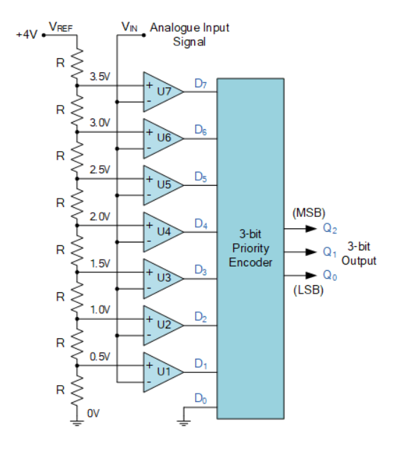 
  Fig. 1: Basic Analog to Digital Converter Block Diagram:

# 8X3 Priority Encoder:
An Encoder has a maximum of 2^n input lines and ‘n’ output lines, hence it encodes the information from 2^n inputs into an n-bit code. It will produce a binary code equivalent to the input, which is active High. 
A 8 to 3 priority encoder has 8 inputs : Y7, Y6, Y5, Y4, Y3, Y2, Y1 & Y0 and 3 outputs : A2, A1 & A0. Here, the input, Y7 has the highest priority, whereas the input, Y0 has the lowest priority. In this case, even if more than one input is ‘1’ at the same time, the output will be the (binary) code corresponding to the input, which is having higher priority.

  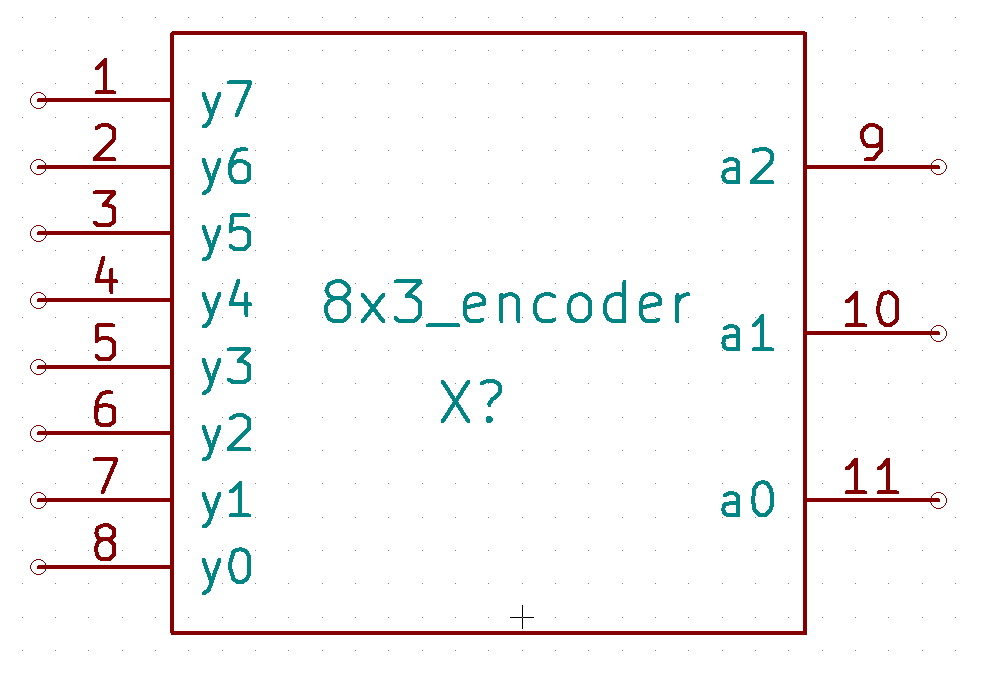 
  Fig. 2: 8X3 Priority Encoder Symbol:

The truth table for the 8X3 Priority Encoder is as follows:

  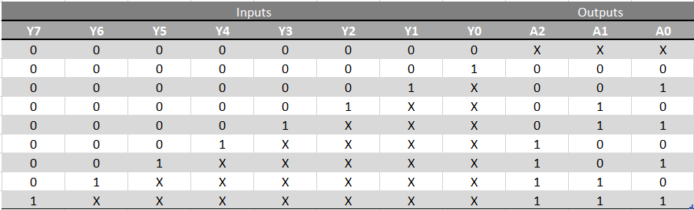 
  Fig. 3: 8X3 Priority Encoder Truth Table:

On solving the above Truth Table using K-Map we get:

    A2 = Y7 + Y6 + Y5 + Y4
    A1 = Y2*Y4bar*Y5bar + Y3*Y4bar*Y5bar + Y6 + Y7
    A0 = Y1*Y2bar*Y4bar*Y6bar + Y3*Y4bar*Y6bar + Y5*Y6bar + Y7

# Buffer Circuits:
A buffer is nothing but a set of two inverters connected in series. We are using a buffer in this circuit mainly for amplifying the digital signal. There are two kinds of buffers used in this circuit one to amplify normal signals and other one to amplify sub-threshold signals. 

# Comparator:
A comparator is a circuit that compares two voltages or currents and outputs a digital signal indicating which is larger. It has two analog input terminals Vin, Vref and one binary digital output that indicates which one of the outputs is higher. If Vin > Vref then the output will be high else the output will be low. It also has an Reset input which when high the output will be low.

   
  Fig. 4: Comparator Symbol:

# Open Source Tools Used:
•  eSim: It is an Open Source EDA developed by FOSSEE, IIT Bombay. It is used for electronic circuit simulation. It is made by the combination of two software namely NgSpice and KiCAD. For more details refer:<a href='https://www.esim.fossee.in/'>Here</a> 

• NgSpice: It is an Open Source Software for Spice Simulations. For more details refer:<a href='http://ngspice.sourceforge.net/docs.html'>Here</a> 

# Pre-Layout Schematics and Simulations:

## Schematics:

### 4X2 Priority Encoder:
Using the below SOPs a 4x2 priority encoder can be implemented.

    A1 = D3 + D2
    A0 = D3 + D1*D2bar

  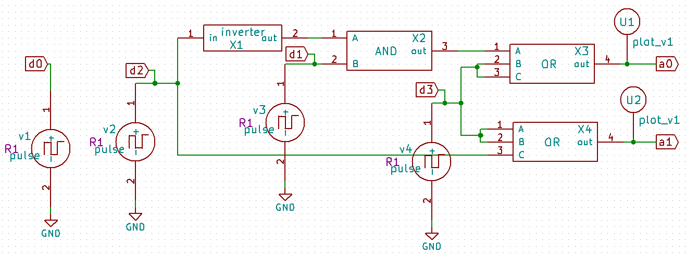 
  Fig. 5: 4X2 Priority Encoder Schematic:

### 8x3 Priority Encoder:
For this circuit in the schematic we can create and then select the Sub circuits under the "eSim_Subckts", connect the circuit as shown in the circuit, annotate the components, perform electrical rules check and generate netlist to complete the schematic. Then using the Sub-circuit feature in the eSIM create the schematic without the sources and replacing the pins with ports to get the below Schematic, then generate the netlist and then go ahead to create a symbol.

  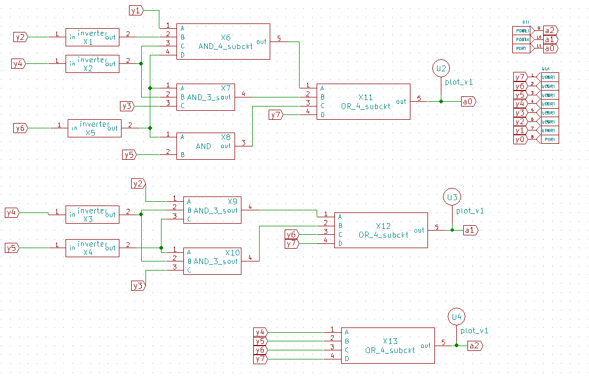 
  Fig. 6: 8X3 Priority Encoder Schematic:

### Buffer:
For this circuit in the schematic we can select the MOSFETS under the "eSim_Devices", connect the circuit as shown in the circuit, annotate the components, perform electrical rules check and generate netlist to complete the schematic. Then using the Sub-circuit feature in the eSIM create the schematic without the sources and replacing the pins with ports, generate the netlist and then go ahead to create a symbol.

  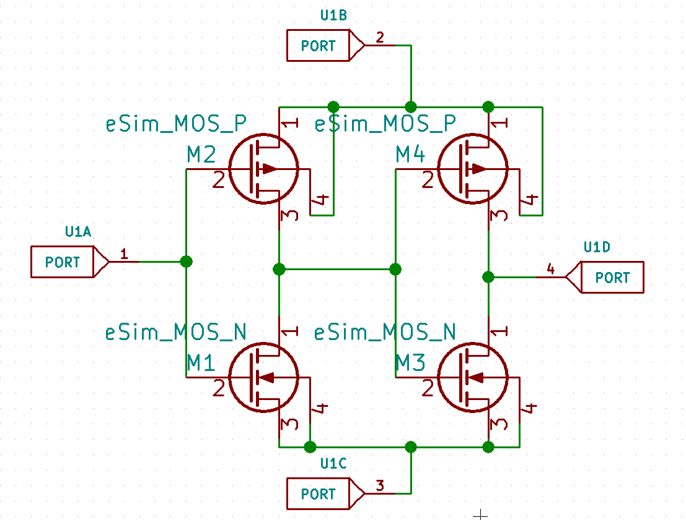 
  Fig. 7: Buffer Schematic:

### Comparator:
For this circuit in the schematic we can select the MOSFETS under the "eSim_Devices", connect the circuit as shown in the circuit, annotate the components, perform electrical rules check and generate netlist to complete the schematic. Then using the Sub-circuit feature in the eSIM create the schematic without the sources and replacing the pins with ports, generate the netlist and then go ahead to create a symbol.

Coming to the working of this circuit, the Port 1 will be the Vref and Port 2 will be Vin and when Vin is higher than Vref the supply potential to the inverter set {M8,M7} will be higher than the inverter set {M4,M5}, hence overpowering the ouput to give HIGH since{M4,M5} will be in cutoff condition. Whereas in the inverted condition where the Vref is higher than Vin the inverter set{M8,M7} will be in cutoff hence giving LOW as the ouput. When the Port 3 i.e Reset is high, the potential at ground i.e LOW is flooded to the supply of the inverter sets {M8,M7} and {M4,M5} giving output as LOW.

  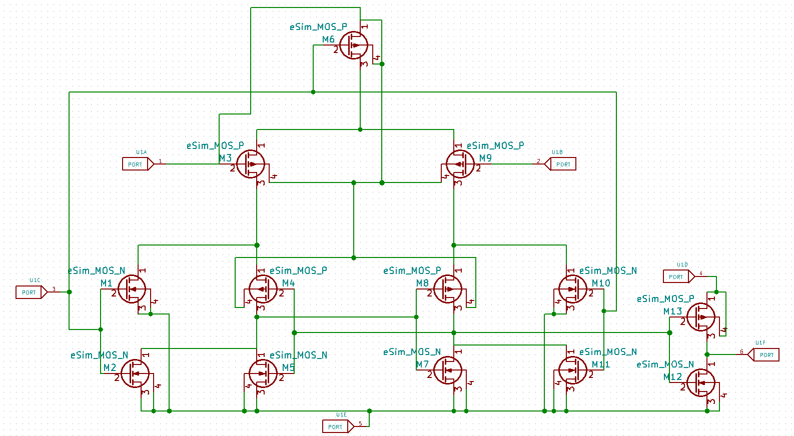 
  Fig. 8: Comparator Schematic:

### 2-Bit Analog to Digital Converter:
After creation of the all the above symbols we interconnect the Comparators, buffers and 4x2 Priority Encoder as shown in the schematic to create the 2-Bit ADC. Based on the input signal given to the Comparator network the Priority Encoder encodes the signal giving a converter Digital Output.

  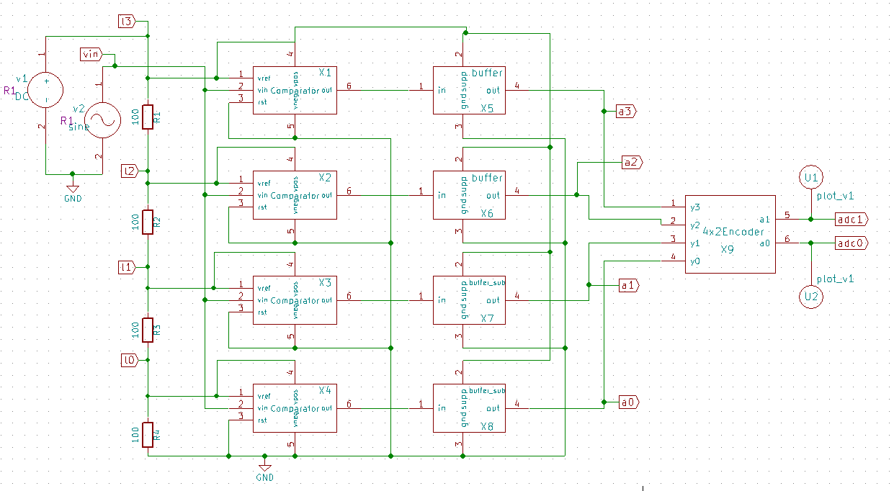 
  Fig. 9: 2-Bit Analog to Digital Converter Schematic:

### 3-Bit Analog to Digital Converter:
After creation of the all the above symbols we interconnect the Comparators, buffers and 8x3 Priority Encoder as shown in the schematic to create the 3-Bit ADC. Based on the input signal given to the Comparator network the Priority Encoder encodes the signal giving a converter Digital Output.

  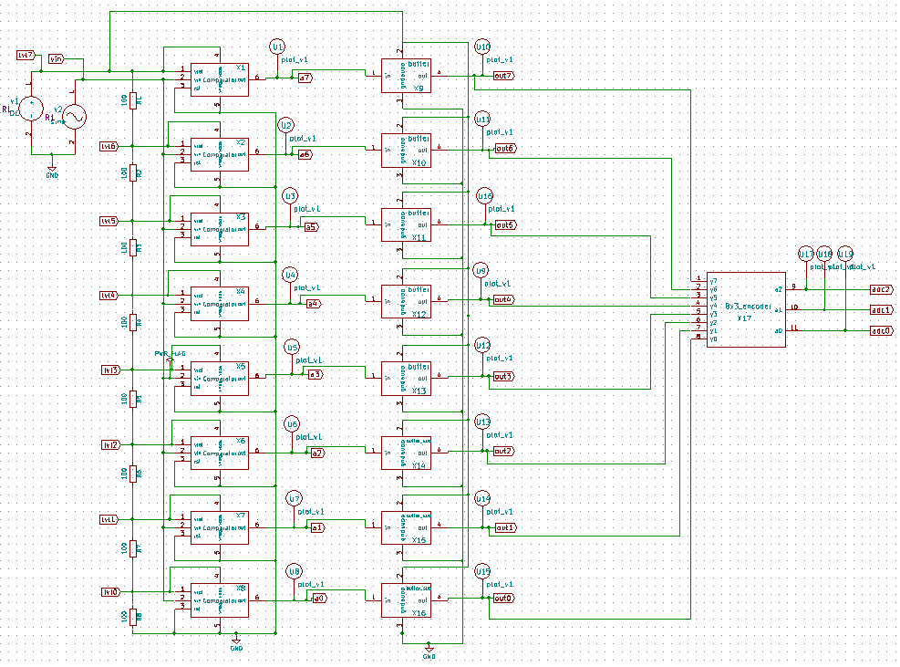 
  Fig. 10: 3-Bit Analog to Digital Converter Schematic:

## Simulations:

### 4X2 Priority Encoder:
After making the schematic and generating the netlist go back to eSim; select the KiCAD to NgSpice converter and give the required parameters, convert the present circuit to NgSpice. After following the above steps run the simulation to get the below output:

  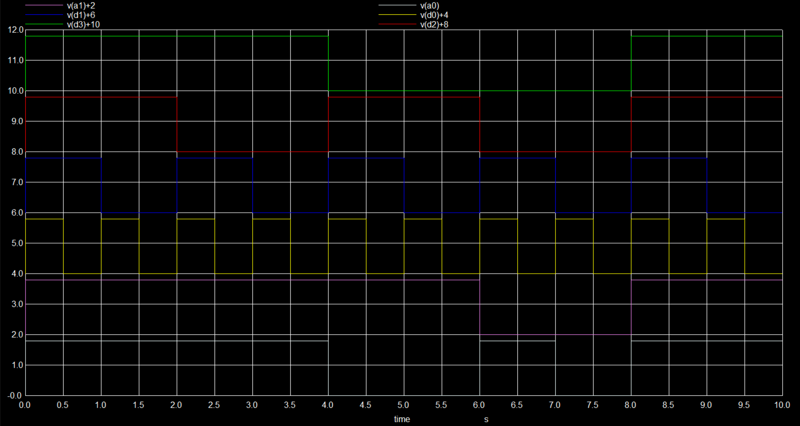 
  Fig. 11: Transient Analysis of 4X2 Priority Encoder:

### 8X3 Priority Encoder:

  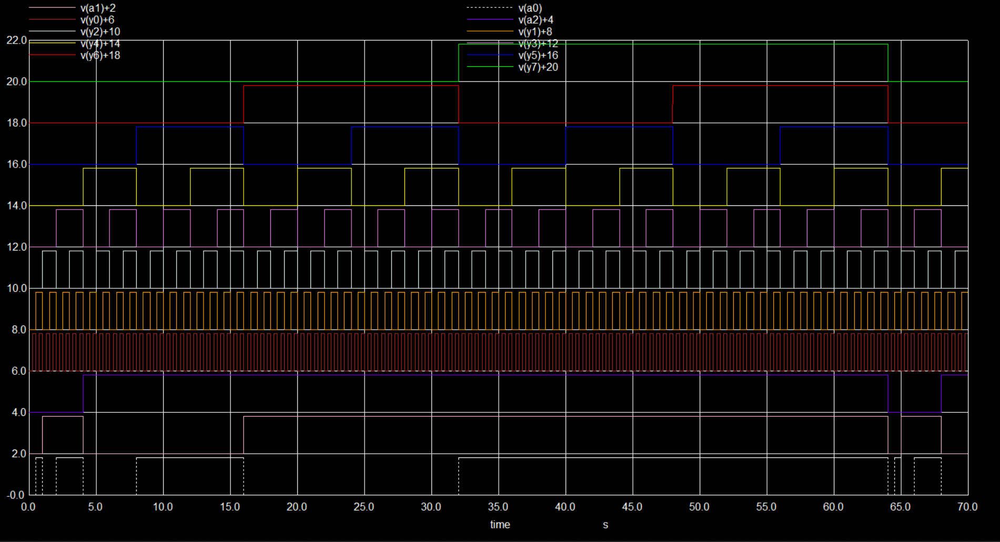 
  Fig. 12: Transient Analysis of 8X3 Priority Encoder:

### Buffer Circuit:

  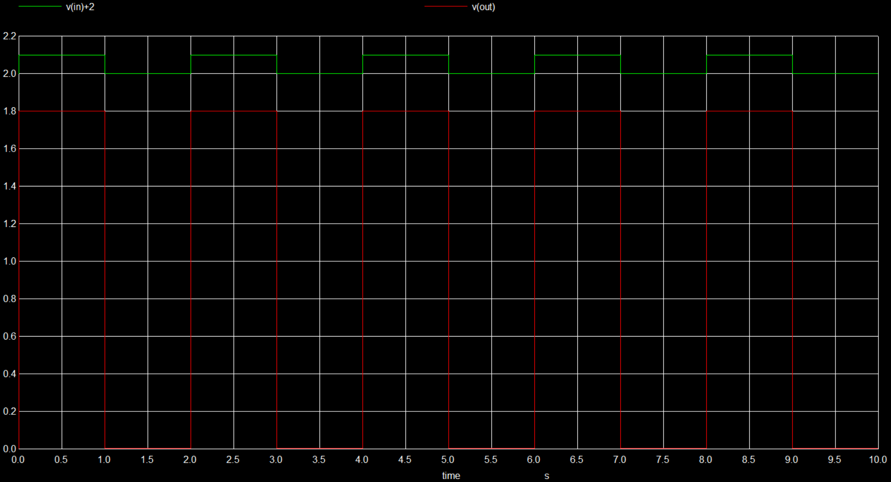 
  Fig. 13: Transient Analysis of Buffer Circuit:

### Comparator:
After making the schematic and generating the netlist go back to eSim; select the KiCAD to NgSpice converter and give the required parameters(such as analysis type, source details, device information, subcircuit information etc), convert the present circuit to NgSpice.To test the Comparator circuit, a varying PWL source was used. After following the above steps run the simulation to get the below output:

  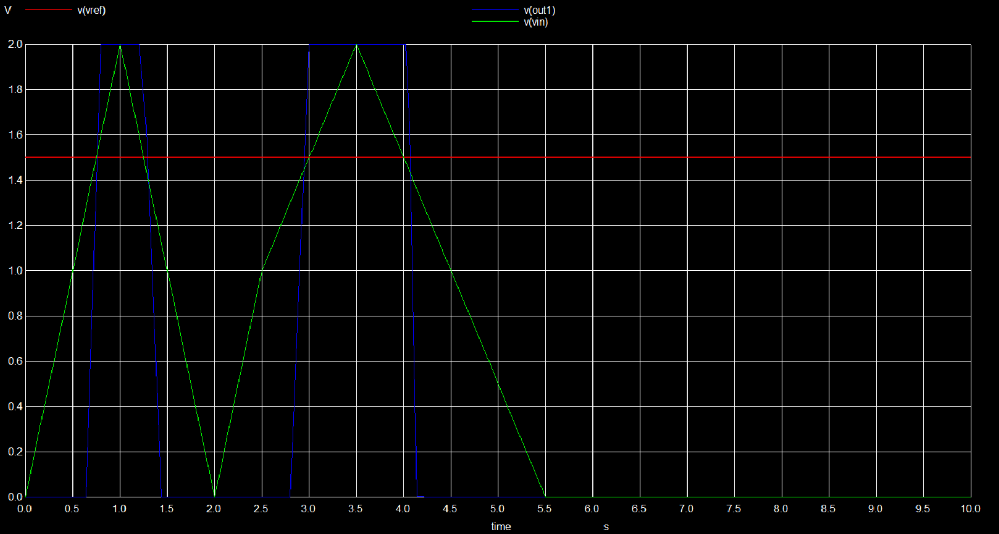 
  Fig. 14: Transient Analysis of Comparator:

### 2-Bit Analog to Digital Converter:

  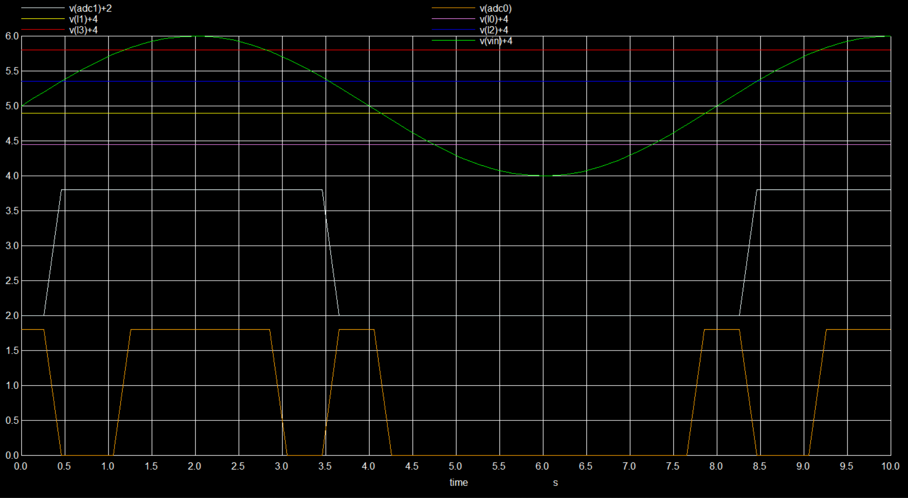 
  Fig. 15: Transient Analysis of 2-Bit ADC:

  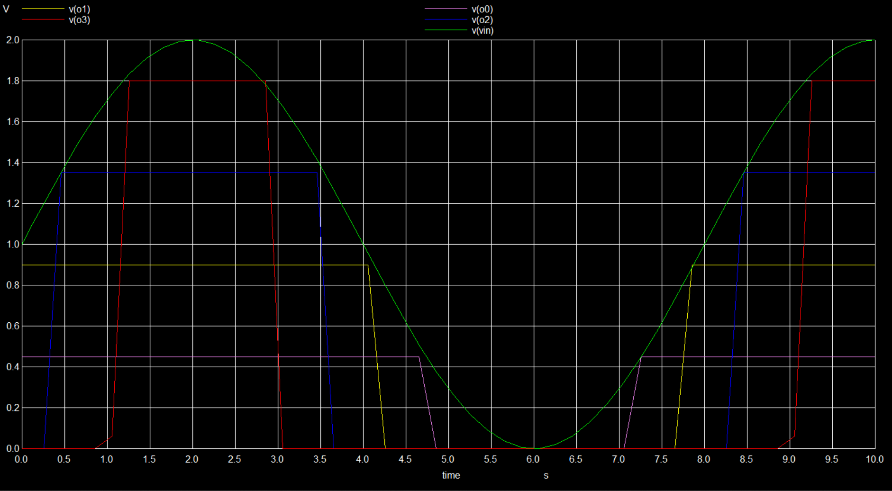 
  Fig. 16: Vin, Comparator Outputs Vs Time:

### 3-Bit Analog to Digital Converter:

  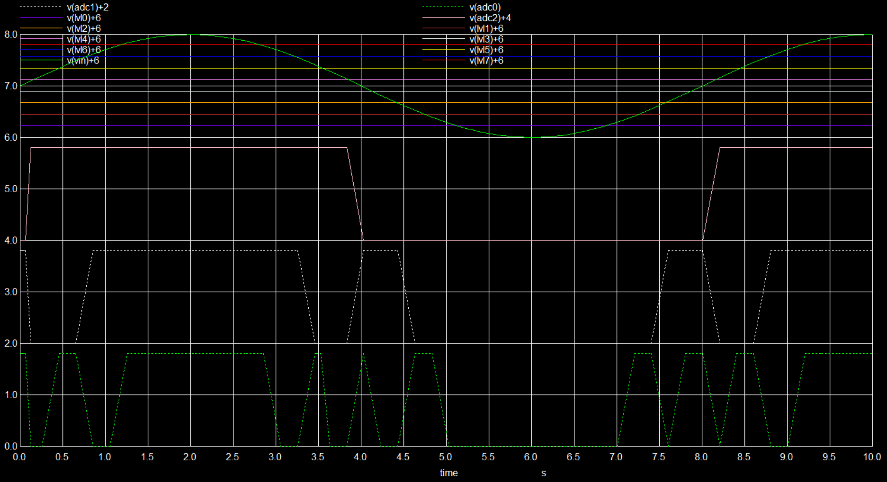 
  Fig. 17: Transient Analysis of 3-Bit ADC:

  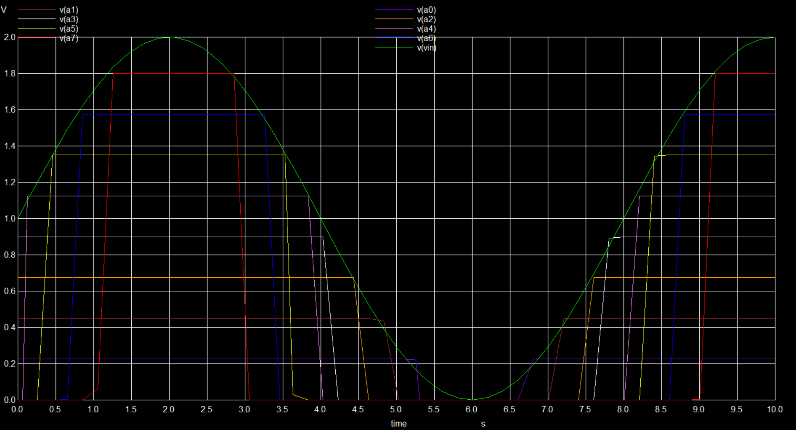 
  Fig. 18: Vin, Comparator Outputs Vs Time:

# Netlist of the Circuits:
• Refer to the netlist of the 3X8 Decoder here: <a href='3x8_decoder/3x8_decoder.cir.out'>Netlist</a> 

• Refer to the netlist of the 6T SRAM Cell here: <a href='6T_RAM_cell/6T_RAM_cell.cir.out'>Netlist</a> 

• Refer to the netlist of the 1-Bit SRAM here: <a href='1-bit_RAM/1-bit_RAM.cir.out'>Netlist</a> 

• Refer to the netlist of the 8-Bit SRAM here: <a href='8-bit_RAM/8-bit_RAM.cir.out'>Netlist</a> 

# Author:
• Trinath Harikrishna, B.Tech(ECE), SRM Institute of Science and Technology, Kattankulattur, Chennai-603203.

# Acknowledgements:
• <a href='https://www.esim.fossee.in/'>FOSSEE Team, IIT Bombay</a> 

# References:
[1] Simon Josephson - <a href='https://ntnuopen.ntnu.no/ntnu-xmlui/bitstream/handle/11250/2433737/8707_FULLTEXT.pdf'>An Ultra-Low Power SAR-ADC in 65nm CMOS Technology</a> 
[2] J. Rabaey, A. Chandrakasan, and B. Nicolic, Digital Integrated Circuits A Design Perspective, 2nd ed.Prentice Hall, 2003.
